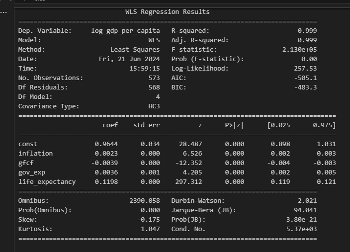

<h1 align="center">Hi 👋, I'm Fatih.</h1>
<h3 align="center">A passionate data person.</h3>

Hey there in this project, I am implementing what I learnt in econometrics, OLS(Ordinary Least Squares). In order for OLS to work, we need 4 assumptions and we are checking those as well in this project. However, first we need to get the dataset from world bank data center.

# Regression Function
The regression function for the log-transformed GDP per capita (log_gdp_per_capita) is:

$$
\log(\text{GDP per capita}) = 0.9644 + 0.0023 \cdot \text{inflation} - 0.0039 \cdot \text{gfcf} + 0.0036 \cdot \text{gov}exp + 0.1198 \cdot \text{life}expectancy
$$

Where:

* **inflation** is the rate of inflation.
* **gfcf** is the gross fixed capital formation as a percentage of GDP.
* **gov_exp** is the government expenditure as a percentage of government expenditure.
* **life_expectancy** is the average life expectancy at birth.
## Interpretation of Coefficients
* **Constant (0.9644)**: This is the baseline value of log(GDP per capita) when all regressors are zero.
* **Inflation (0.0023)**: A 1% increase in inflation is associated with a 0.23% increase in GDP per capita, holding other variables constant.
* **Gross Fixed Capital Formation (gfcf) (-0.0039)**: A 1% increase in gfcf is associated with a 0.39% decrease in GDP per capita, holding other variables constant.
* **Government Expenditure (gov_exp) (0.0036)**: A 1% increase in government expenditure is associated with a 0.36% increase in GDP per capita, holding other variables constant.
* **Life Expectancy (0.1198)**: A 1-year increase in life expectancy is associated with a 11.98% increase in GDP per capita, holding other variables constant.
## Overall Model Performance
* **R-squared (0.999)**: The model explains 99.9% of the variability in the log of GDP per capita, indicating an excellent fit.
* **Adjusted R-squared (0.999)**: The adjusted R-squared, which accounts for the number of predictors in the model, also indicates an excellent fit.
* **F-statistic (2.130e+05)**: The high F-statistic value and its associated p-value (0.00) suggest that the overall model is statistically significant.
* **Durbin-Watson Statistic (2.021)**: This value, close to 2, indicates no significant autocorrelation in the residuals.
* **Jarque-Bera Test**: The Jarque-Bera test statistic (88.132) and its p-value (7.284e-20) indicate that the residuals are not normally distributed, which is a violation of one of the CLRM assumptions.

## Assumptions Check and Final Remarks
Several assumptions were checked to ensure the OLS estimators' desirable properties:

1. Linearity: Only life expectancy shows a linear relationship with the dependent variable, while other variables may exhibit non-linear patterns. This suggests a potential area for model improvement by considering non-linear transformations or interactions for the other variables.
2. Independence: The Durbin-Watson statistic suggests that there is no significant autocorrelation in the residuals.
3. Homoscedasticity: The Breusch-Pagan test indicates heteroscedasticity in the residuals (LM Statistic: 23.764, p-value: 8.906e-05). The use of WLS partially addresses this issue by providing robust standard errors.

4. Normality: The Jarque-Bera test indicates a violation of the normality assumption. This can be addressed by further data transformation or by employing robust statistical techniques.

### In conclusion, the final WLS model provides a strong fit for predicting the log of GDP per capita using the given regressors. Despite some violations of the classical assumptions, particularly in linearity and normality of residuals, the model remains robust and statistically significant. Further steps could involve addressing these violations to improve the model's reliability and predictive power.